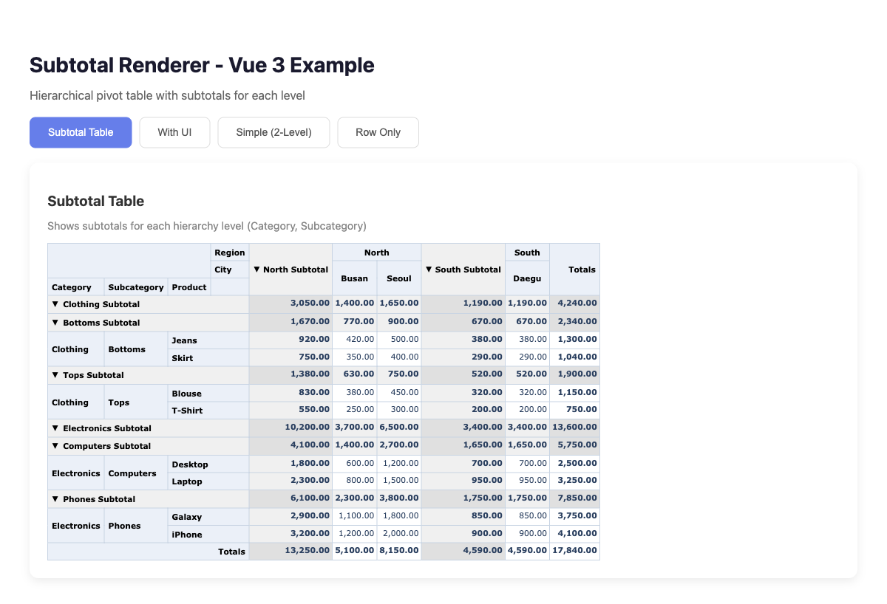
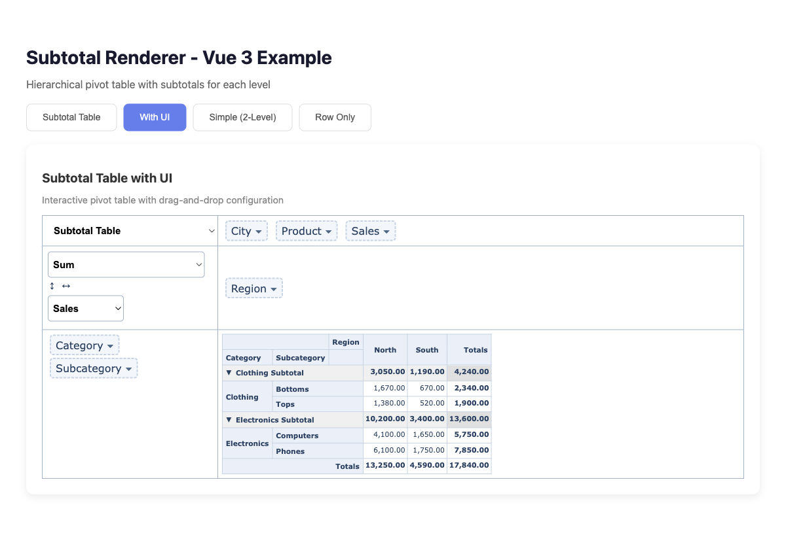
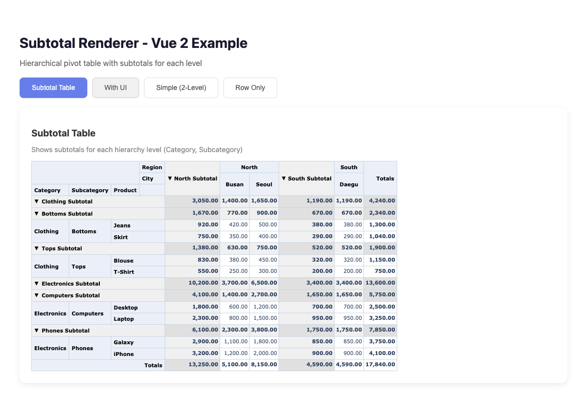

# @vue-pivottable/subtotal-renderer

Subtotal renderer for [vue-pivottable](https://github.com/Seungwoo321/vue-pivottable) with expand/collapse support. Inspired by [subtotal.js](https://github.com/nagarajanchinnasamy/subtotal).

Supports both **Vue 2** and **Vue 3**.

## Screenshots

### Vue 3 - Subtotal Table



### Vue 3 - With UI



### Vue 2 - Subtotal Table



### Vue 2 - With UI


## Features

- 📊 **Subtotal rows and columns** - Automatically calculates and displays subtotals for hierarchical data
- 🔄 **Expand/Collapse** - Click to expand or collapse row/column groups
- 🎨 **Styled subtotal rows** - Visual distinction for subtotal rows
- 🖱️ **Click callbacks** - Supports the same click callback as the standard renderer
- 📝 **Labels support** - Custom label formatting for row/column values

## Installation

```bash
npm install @vue-pivottable/subtotal-renderer
```

## Usage

### Vue 3

```vue
<template>
  <VuePivottable
    :data="data"
    :rows="['Category', 'Subcategory', 'Product']"
    :cols="['Region', 'City']"
    :vals="['Sales']"
    aggregatorName="Sum"
    :renderers="SubtotalRenderers"
    rendererName="Subtotal Table"
  />
</template>

<script setup>
import { VuePivottable, PivotUtilities } from 'vue-pivottable'
import { createSubtotalRenderers } from '@vue-pivottable/subtotal-renderer'
import 'vue-pivottable/dist/vue-pivottable.css'

// Create SubtotalRenderers with PivotData from vue-pivottable
const SubtotalRenderers = createSubtotalRenderers(PivotUtilities.PivotData)

const data = [
  { Category: 'Electronics', Subcategory: 'Phones', Product: 'iPhone', Region: 'North', City: 'Seoul', Sales: 1000 },
  { Category: 'Electronics', Subcategory: 'Phones', Product: 'Samsung', Region: 'North', City: 'Seoul', Sales: 800 },
  { Category: 'Electronics', Subcategory: 'Laptops', Product: 'MacBook', Region: 'North', City: 'Busan', Sales: 1500 },
  { Category: 'Clothing', Subcategory: 'Shirts', Product: 'T-Shirt', Region: 'South', City: 'Daegu', Sales: 200 },
  // ... more data
]
</script>
```

### Vue 2

```vue
<template>
  <VuePivottable
    :data="data"
    :rows="['Category', 'Subcategory', 'Product']"
    :cols="['Region', 'City']"
    :vals="['Sales']"
    aggregatorName="Sum"
    :renderers="SubtotalRenderers"
    rendererName="Subtotal Table"
  />
</template>

<script>
import { VuePivottable, PivotUtilities } from 'vue-pivottable'
import { createSubtotalRenderers } from '@vue-pivottable/subtotal-renderer/vue2'
import 'vue-pivottable/dist/vue-pivottable.css'

// Create SubtotalRenderers with PivotData from vue-pivottable
const SubtotalRenderers = createSubtotalRenderers(PivotUtilities.PivotData)

export default {
  components: { VuePivottable },
  data() {
    return {
      SubtotalRenderers,
      data: [
        // ... your data
      ]
    }
  }
}
</script>
```

## With PivotTable UI

You can also use the subtotal renderer with the interactive PivotTable UI:

### Vue 3

```vue
<template>
  <VuePivottableUi
    :data="data"
    :rows="['Category', 'Subcategory']"
    :cols="['Region']"
    :vals="['Sales']"
    aggregatorName="Sum"
    :renderers="SubtotalRenderers"
    rendererName="Subtotal Table"
  />
</template>

<script setup>
import { VuePivottableUi, PivotUtilities } from 'vue-pivottable'
import { createSubtotalRenderers } from '@vue-pivottable/subtotal-renderer'
import 'vue-pivottable/dist/vue-pivottable.css'

const SubtotalRenderers = createSubtotalRenderers(PivotUtilities.PivotData)
</script>
```

## Subtotal Options

You can customize the subtotal behavior using the `subtotalOptions` prop:

```vue
<VuePivottable
  :data="data"
  :renderers="SubtotalRenderers"
  rendererName="Subtotal Table"
  :subtotalOptions="{
    rowSubtotalDisplay: {
      displayOnTop: false,
      enabled: true,
      hideOnExpand: false
    },
    colSubtotalDisplay: {
      displayOnTop: false,
      enabled: true,
      hideOnExpand: false
    },
    arrowCollapsed: '▶',
    arrowExpanded: '▼'
  }"
/>
```

### Options

| Option | Type | Default | Description |
|--------|------|---------|-------------|
| `rowSubtotalDisplay.enabled` | `boolean` | `true` | Enable row subtotals |
| `rowSubtotalDisplay.displayOnTop` | `boolean` | `false` | Display subtotals above the group |
| `rowSubtotalDisplay.hideOnExpand` | `boolean` | `false` | Hide subtotals when group is expanded |
| `colSubtotalDisplay.enabled` | `boolean` | `true` | Enable column subtotals |
| `colSubtotalDisplay.displayOnTop` | `boolean` | `false` | Display subtotals to the left of the group |
| `colSubtotalDisplay.hideOnExpand` | `boolean` | `false` | Hide subtotals when group is expanded |
| `arrowCollapsed` | `string` | `'▶'` | Arrow character for collapsed state |
| `arrowExpanded` | `string` | `'▼'` | Arrow character for expanded state |

## Click Callback

The subtotal renderer supports the same `clickCallback` as the standard renderer:

```vue
<VuePivottable
  :data="data"
  :renderers="SubtotalRenderers"
  rendererName="Subtotal Table"
  :tableOptions="{
    clickCallback: (event, value, filters, pivotData) => {
      console.log('Clicked value:', value)
      console.log('Filters:', filters)
    }
  }"
/>
```

## Custom Labels

Use the `labels` prop to customize how values are displayed:

```vue
<VuePivottable
  :data="data"
  :renderers="SubtotalRenderers"
  rendererName="Subtotal Table"
  :labels="{
    Category: (val) => val.toUpperCase(),
    Region: (val) => `Region: ${val}`
  }"
/>
```

## Styling

The renderer adds specific CSS classes for styling:

```css
/* Subtotal rows */
.pvtSubtotalRow {
  background-color: #f5f5f5;
}

/* Subtotal label cells */
.pvtSubtotalLabel {
  font-weight: bold;
  background-color: #e8e8e8;
}

/* Subtotal value cells */
.pvtSubtotalVal {
  font-weight: bold;
  background-color: #f0f0f0;
}

/* Collapse toggle */
.pvtCollapseToggle {
  cursor: pointer;
  user-select: none;
}

.pvtCollapseToggle:hover {
  color: #0066cc;
}
```

## How It Works

1. **Hierarchical Keys**: When you have multiple row/column attributes (e.g., `['Category', 'Subcategory', 'Product']`), the renderer creates subtotal rows for each level of the hierarchy.

2. **Subtotal Calculation**: For each subtotal row, the renderer sums up all values in the child rows. For example, the "Electronics" subtotal includes all phones and laptops.

3. **Expand/Collapse**: Clicking the arrow icon collapses or expands the child rows. When collapsed, only the subtotal row is visible.

## Comparison with Standard Renderer

| Feature | Standard Renderer | Subtotal Renderer |
|---------|-------------------|-------------------|
| Row/Column totals | ✅ | ✅ |
| Grand total | ✅ | ✅ |
| Subtotals | ❌ | ✅ |
| Expand/Collapse | ❌ | ✅ |
| Click callback | ✅ | ✅ |
| Labels | ✅ | ✅ |
| Heatmap | ✅ | ❌ (planned) |

## Running Examples

```bash
# Clone the repository
git clone https://github.com/user/vue3-pivottable.git

# Navigate to the subtotal-renderer package
cd vue3-pivottable/subtotal-renderer

# Install dependencies
npm install

# Run Vue 3 example
cd examples/vue3
npm install
npm run dev

# Run Vue 2 example (in another terminal)
cd examples/vue2
npm install
npm run dev
```

## Requirements

- Vue 2.6+ or Vue 3.0+
- vue-pivottable (matching version)

## License

MIT
